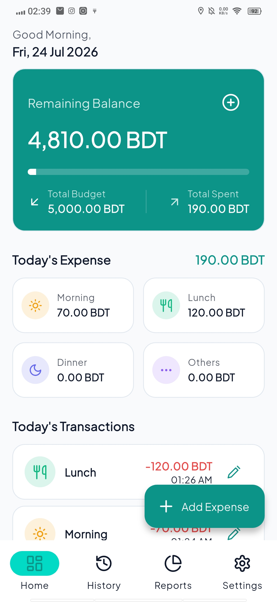
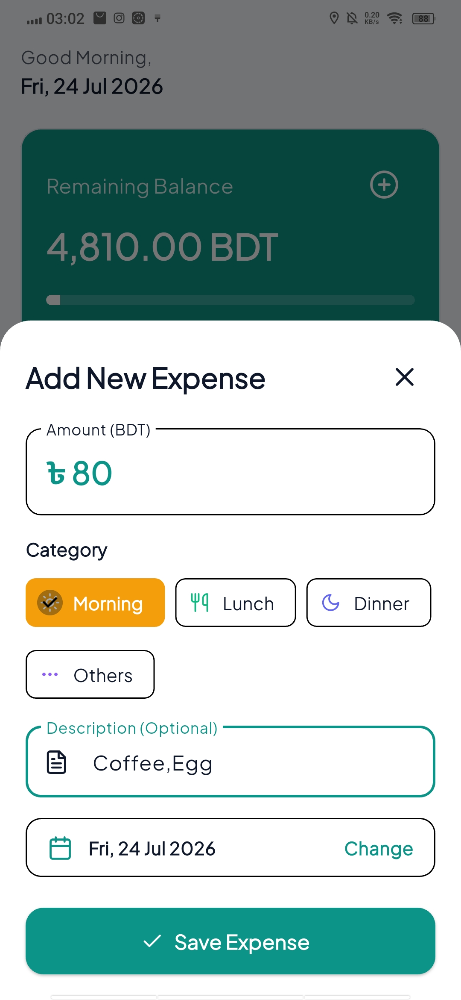
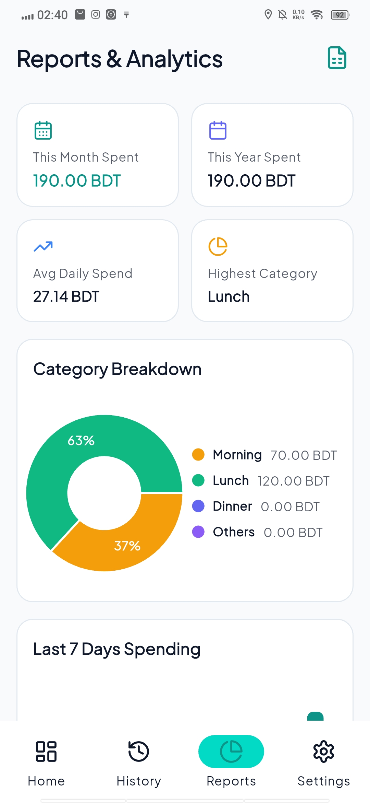
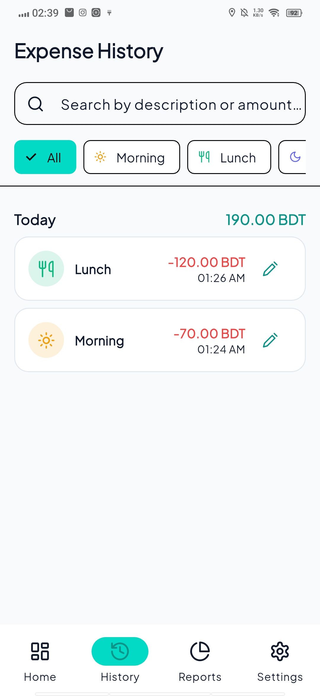
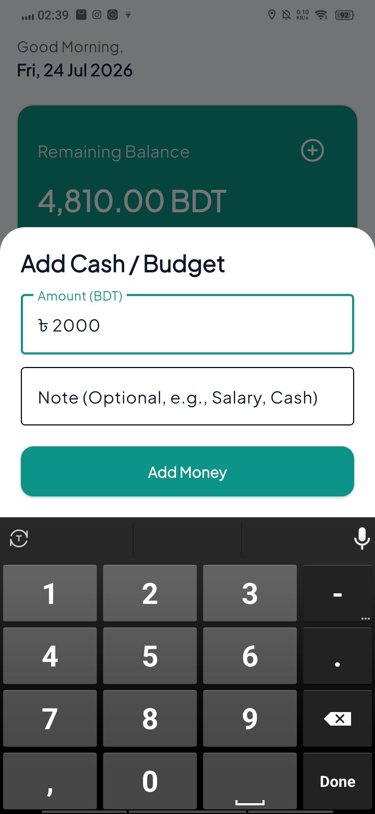
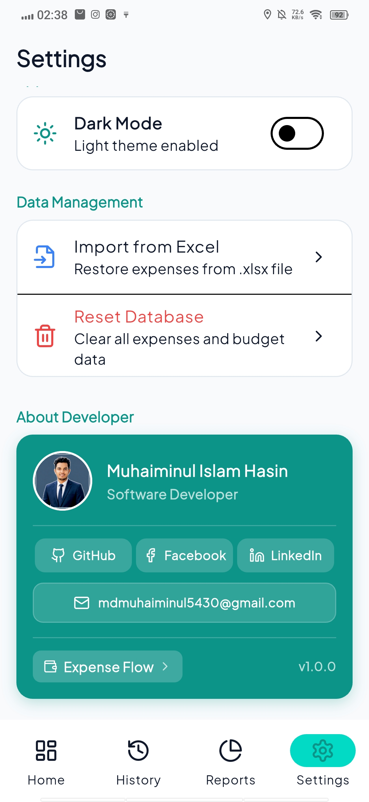
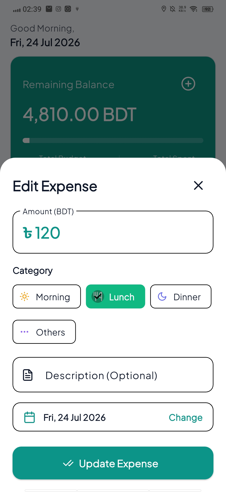
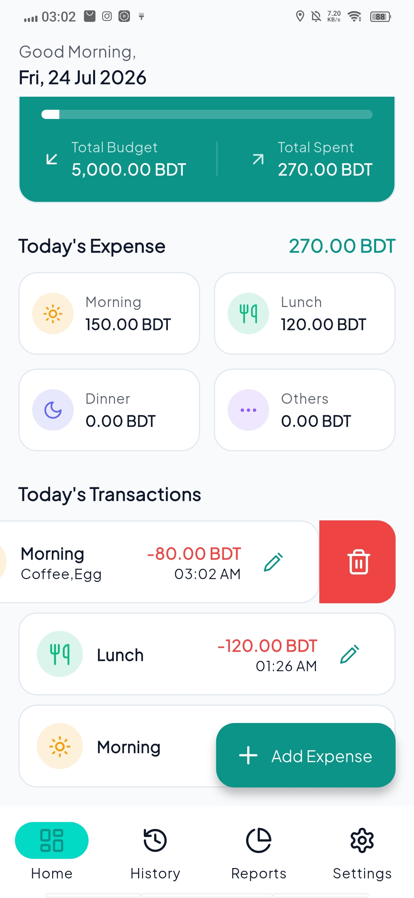
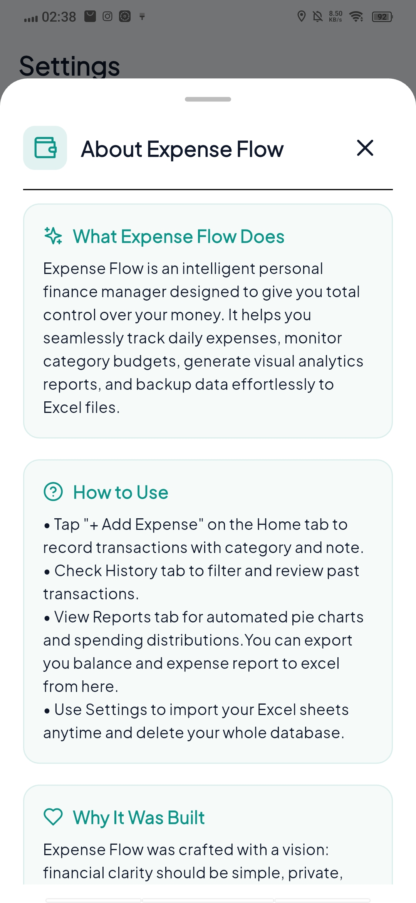
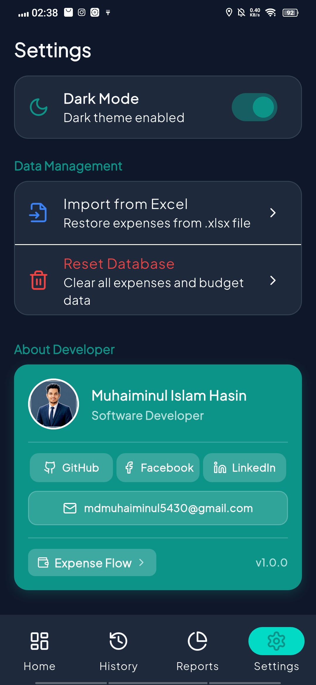

# 💸 Expense Flow

<div align="center">


### Modern Personal Expense Tracker built with Flutter

Track your daily expenses, manage budgets, visualize spending habits and stay in control of your finances.


</div>

---

# 📸 Screenshots

| Dashboard | Add Expense |
|------------|------------|
|  |  |

| Reports | History |
|------------|------------|
|  |  |

| Budget | Settings |
|------------|------------|
|  |  |

| Edit Expense | Delete Expense |
|------------|------------|
|  |  |

| About | Dark Mode |
|------------|------------|
|  |  |


---

#  Features

-  Clean Dashboard
-  Income & Expense Management
-  Daily, Weekly & Monthly Reports
-  Interactive Charts
-  Budget Management
-  Dark & Light Theme
-  Excel Import
-  Excel Export
-  Offline Local Storage
-  Smooth Animations
-  Responsive UI

---

#  Tech Stack

| Technology | Usage |
|------------|-------|
| Flutter | UI Framework |
| Dart | Programming Language |
| Riverpod | State Management |
| SQLite | Local Database |
| FL Chart | Analytics |
| Shared Preferences | App Settings |
| Excel | Import & Export |

---

# 📂 Project Structure

```text
lib/
│
├── app/
│   ├── routes/
│   └── theme/
│
├── core/
│   ├── constants/
│   ├── database/
│   └── utils/
│
├── features/
│   ├── budget/
│   ├── dashboard/
│   ├── expense/
│   ├── history/
│   ├── reports/
│   └── settings/
│
├── shared/
│   ├── models/
│   └── widgets/
│
└── main.dart
```

#  Getting Started

```bash
git clone https://github.com/m35hasinoob/Expense-Flow.git

cd Expense-Flow

flutter pub get

flutter run
```


#  Main Packages

- flutter_riverpod
- sqflite
- fl_chart
- excel
- shared_preferences
- file_picker
- share_plus
- flutter_animate
- google_fonts

---

#  Future Improvements

- Cloud Backup
- Google Sign In
- Multi-device Sync
- Notification Reminder
- Multiple Currency Support
- Recurring Transactions

---


##  Author


<div align="center">


### Muhaiminul Islam Hasin

Flutter Developer • CSE Student • Mobile App Development Enthusiast

[](https://github.com/m35hasinoob)
[](https://www.linkedin.com/in/m67hasinoob/)
[](https://www.facebook.com/mdmuhaiminulislam.hasin)

</div>


---

#  Support

If you found this project useful, please consider giving it a ⭐ on GitHub.

---

#  License

This project is licensed under the MIT License.